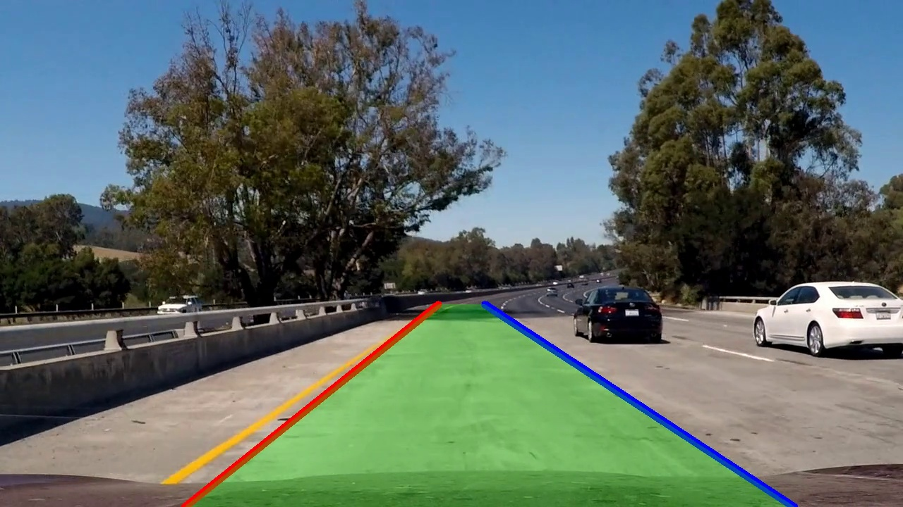
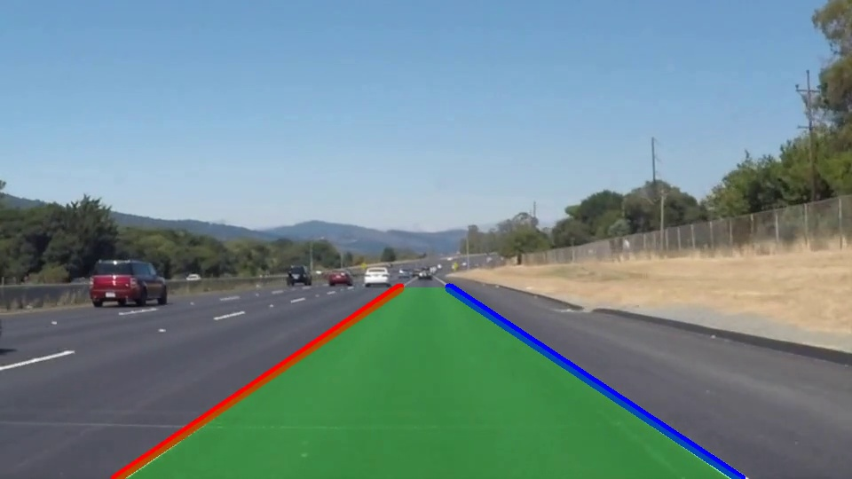

# Lane Line Detection System# Lane Line Detection System


[](https://python.org)[](https://python.org)

[](https://opencv.org)[](https://opencv.org)

[](LICENSE)[](LICENSE)


A robust computer vision system for real-time lane detection in video streams. Built with OpenCV and optimized for accuracy and stability across diverse road conditions.A robust computer vision system for real-time lane detection in video streams. Built with OpenCV and optimized for accuracy and stability across diverse road conditions.


## 🚀 Quick Start## 🚀 Quick Start


### Installation### Installation


```bash`ash

pip install -r requirements.txtpip install -r requirements.txt

````


### Usage### Usage


```bash`ash

# Process challenge video (shadows, curves)# Process challenge video (shadows, curves)

python process_challenge.pypython process_challenge.py


# Process regular videos# Process regular videos

python process_video.pypython process_video.py


# Process single images# Process single images

python process_image.pypython process_image.py

````


### Advanced Usage### Advanced Usage


```bash`ash

# Custom parameters# Custom parameters

python unified_lane_detection.py input_video.mp4 -m auto -o output.mp4python unified_lane_detection.py input_video.mp4 -m auto -o output.mp4


# Detection modes: auto, challenging, easy# Detection modes: auto, challenging, easy

python unified_lane_detection.py video.mp4 -m challengingpython unified_lane_detection.py video.mp4 -m challenging

````


## ✨ Features## ✨ Features


- **Stable Detection**: No flickering, smooth lane tracking- **Stable Detection**: No flickering, smooth lane tracking

- **Multiple Modes**: Auto, challenging (shadows/curves), easy (highways)- **Multiple Modes**: Auto, challenging (shadows/curves), easy (highways)

- **Color Processing**: HLS color space + Sobel edge detection- **Color Processing**: HLS color space + Sobel edge detection

- **Temporal Smoothing**: 5-frame history for stability- **Temporal Smoothing**: 5-frame history for stability

- **Error Handling**: Graceful fallbacks for failed detections- **Error Handling**: Graceful fallbacks for failed detections


## 📊 Performance## 📊 Performance


| Test Scenario | Success Rate | Processing Time || Test Scenario | Success Rate | Processing Time |

|---------------|--------------|-----------------||---------------|--------------|-----------------|

| Challenge Video | 100% (252/252 frames) | ~15ms/frame || Challenge Video | 100% (252/252 frames) | ~15ms/frame |

| Highway Video | 100% (222/222 frames) | ~12ms/frame || Highway Video | 100% (222/222 frames) | ~12ms/frame |


## 🖼️ Results## 🖼️ Results


### Challenge Video (Shadows & Curves)### Challenge Video (Shadows & Curves)




### Highway Video  ### Highway Video  




## 📁 Project Structure## 📁 Project Structure


````

├── unified_lane_detection.py    # Main detection system├── unified_lane_detection.py    # Main detection system

├── process_challenge.py         # Quick challenge processing├── process_challenge.py         # Quick challenge processing

├── process_video.py             # Quick video processing├── process_video.py             # Quick video processing

├── process_image.py             # Quick image processing├── process_image.py             # Quick image processing

├── requirements.txt             # Dependencies├── requirements.txt             # Dependencies

├── test_image/                  # Sample images├── test_image/                  # Sample images

├── test_vedios/                 # Sample videos├── test_vedios/                 # Sample videos

└── outputs/                     # Results└── outputs/                     # Results

````


## 🔧 Requirements## 🔧 Requirements


- **Python**: 3.8+- **Python**: 3.8+

- **OpenCV**: 4.8+- **OpenCV**: 4.8+

- **NumPy**: 1.24+- **NumPy**: 1.24+

- **MoviePy**: 1.0.3+- **MoviePy**: 1.0.3+


## 📄 License## 📄 License


MIT License - see [LICENSE](LICENSE) file for details.MIT License - see [LICENSE](LICENSE) file for details.


------


*Lane detection system for autonomous vehicle applications**Lane detection system for autonomous vehicle applications*
